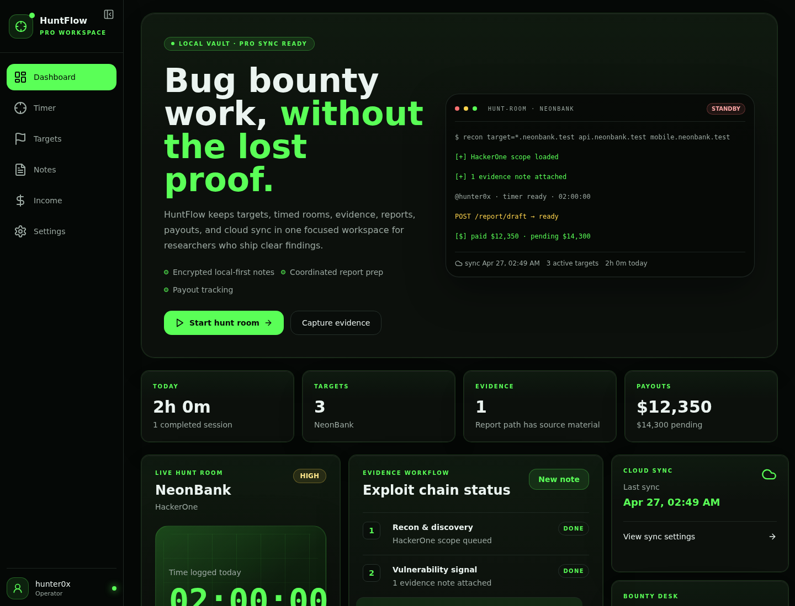
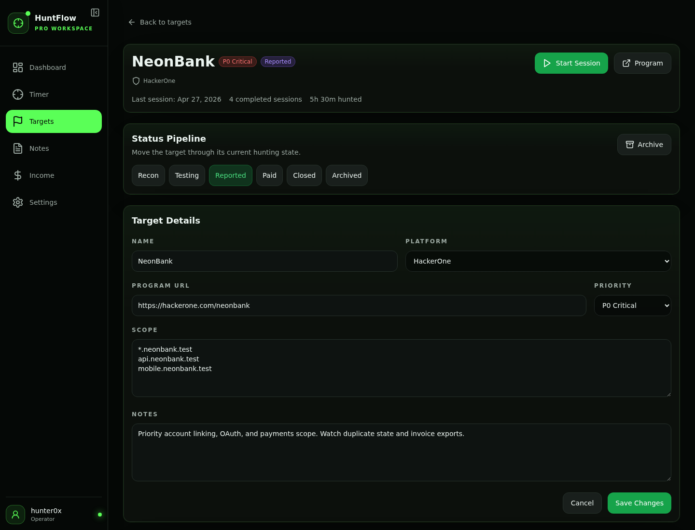
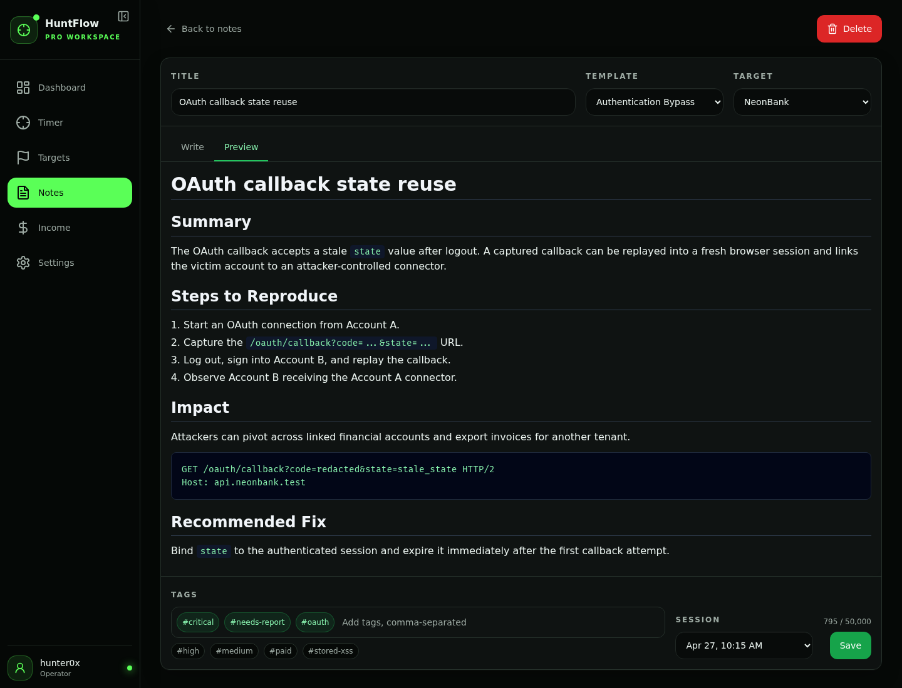
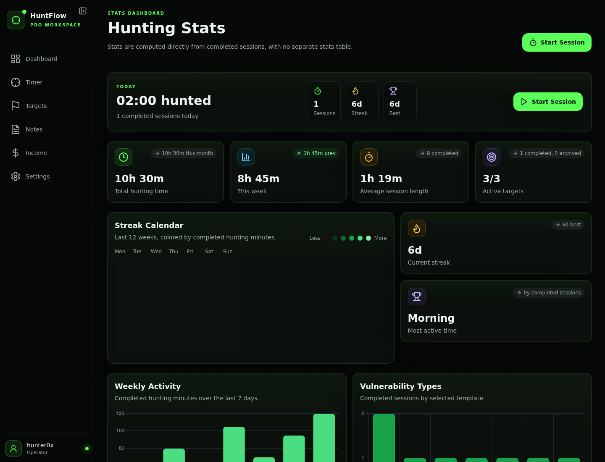
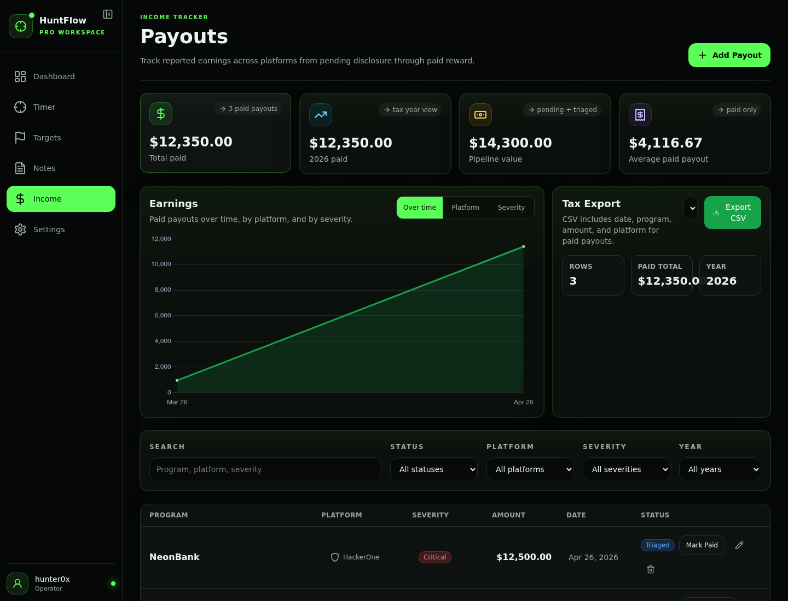

# HuntFlow

Your personal bug bounty command center. Track targets, time hunts, capture evidence, draft reports, and monitor payouts — all from a single local-first app that runs entirely on your machine.

## Why HuntFlow?

- **Local-first, zero telemetry** — Your data stays in your browser. No accounts required, no tracking, nothing phones home.
- **Purpose-built for hunters** — Every feature is designed around real bug bounty workflows, not retrofitted from generic project tools.
- **Offline-ready PWA** — Works without an internet connection. Install it like a native app.
- **Optional cloud sync** — Sign in to sync across devices when you need it. Skip it when you don't.

## Quick Start

Run HuntFlow locally with one command:

```bash
npx huntflow
```

Opens your browser at `http://localhost:3000` with a fresh workspace ready to go.

To install globally:

```bash
npm install -g huntflow
huntflow
```

Override the default port:

```bash
npx huntflow --port 4000
```

## What You Get

- **Target Tracker** — Organize programs by platform, priority, status, and scope
- **Focus Timer** — Timed hunt sessions with completion notes and tags
- **Notes** — Rich markdown notes with templates, preview, and autosave
- **Evidence Vault** — Proof files, URLs, code snippets, and relationship mapping
- **Report Builder** — Auto-populated reports with severity suggestions and PDF/markdown export
- **Stats Dashboard** — Visualize your hunting patterns and progress
- **Income Tracker** — Track payouts, status progression, and export for taxes
- **Cloud Sync (Pro)** — Optional sync across devices with end-to-end security

## Screenshots



| Targets | Notes |
| --- | --- |
|  |  |

| Stats | Income |
| --- | --- |
|  |  |

## License

HuntFlow is proprietary software. Copyright © 2026 xalgord. All rights reserved.

You may install and use HuntFlow on your own devices for personal or internal business use under the terms in [`LICENSE`](./LICENSE). Redistribution, resale, sublicensing, and reverse engineering are not permitted.

For commercial licensing or inquiries → [huntflow.xalgorix.com](https://huntflow.xalgorix.com)
